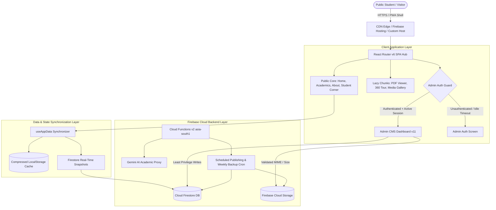

# GNC Digital Campus — Architecture & System Design (Website 2.0)
**Institution:** Guru Nanak College, Dhanbad (Affiliated to Binod Bihari Mahto Koyalanchal University, Dhanbad)  
**Specification Reference:** GNC Website 2.0 Master Prompt — Section 68, 69, 70, 93, 94  
**Classification:** Institutional Technical Architecture Document  

---

## 1. Executive Summary & Architectural Mission
Guru Nanak College Digital Campus 2.0 is an enterprise-grade collegiate digital governance and academic portal. The system delivers a fast, mobile-first, accessible, and secure digital platform serving over 4,000 students, faculty, alumni, and administrative staff across two campuses (Bhuda Main Campus & Bank More Girls Wing).

### Key Architectural Tenets:
1. **Preservation of Proven Functionality:** Built upon the established React 18, Vite, and Firebase architecture without destructive framework re-writes.
2. **Aggressive Route-Level Code Splitting (Section 33):** The public critical bundle contains zero heavy dependencies (no PDF parser, charting libraries, photo spheres, or rich editors).
3. **Tab-Scoped Admin Session Security (Section 81):** Enforces `browserSessionPersistence` and client activity heartbeat monitoring with automatic idle termination.
4. **Host-Agnostic Portability (Section 93):** Fully configurable base URLs, dynamic canonical domain resolution, and universal SPA 404 fallback routing for Firebase Hosting, Cloudflare Pages, Netlify, or GitHub Pages.

---

## 2. High-Level Architecture Diagram



---

## 3. Directory & Component Hierarchy

```
gnc-college/
├── functions/                     # Cloud Functions v2 (Node.js ESM)
│   ├── index.js                  # geminiProxy, onContactFormSubmitted, scheduledFirestoreBackup, processScheduledPublishing
│   └── package.json
├── public/                       # Static Assets & Progressive Web App
│   ├── 404.html                  # Host-Agnostic SPA Fallback Resolver
│   ├── manifest.json             # Web App Manifest
│   ├── sitemap.xml               # Dynamic Canonical XML Sitemap (106 Routes)
│   ├── sw.js                     # Workbox Service Worker Pre-caching
│   └── images/                   # Optimized WebP/AVIF Institutional Media
├── scripts/                      # Build & Validation Tooling
│   ├── generateSitemap.js        # Automated Sitemap Generator
│   ├── runPlaywrightQA.js        # Responsive 48-Check Playwright Matrix
│   └── runUnitTests.js           # Lightweight Headless Assertion Runner
├── src/
│   ├── components/
│   │   ├── admin/                # Admin CMS Subsystem
│   │   │   ├── AdminPanel.jsx    # Master CMS Shell with RBAC & Idle Timeout
│   │   │   ├── AdminShared.jsx   # Shared UI Tokens & Primitives
│   │   │   └── tabs/             # 28 Modular Admin Capabilities
│   │   ├── home/                 # Dynamic Homepage Presentation Modules
│   │   ├── layout/               # Navbars, Headers, Footers, Modals
│   │   ├── AppRoutes.jsx         # Centralized Route Registry with safeLazy
│   │   ├── PDFModal.jsx          # Native/PDF.js Dynamic Modal Engine
│   │   └── UniversalSearch.jsx   # Ctrl+K Command Palette with Fuzzy Index
│   ├── hooks/                    # Reusable React State Hooks
│   │   ├── useAdminIdleTimeout.js# Inactivity Heartbeat & Session Expiry
│   │   ├── useAppData.js         # Offline Cache & Sync Engine
│   │   └── useDraftAutoSave.js   # Debounced CMS Autosave
│   ├── pages/                    # Route-Level Page Containers
│   │   ├── HomePage.jsx
│   │   ├── StudentCornerPage.jsx # Unified Student Hub (Section 18)
│   │   ├── DocumentRequestPage.jsx
│   │   └── ...
│   ├── styles/
│   │   ├── colors.js             # Section 4 Design Tokens
│   │   └── index.css             # Fluid clamp() Typography & Global Styles
│   ├── utils/                    # Shared Utilities
│   │   ├── confetti.js           # Dynamic Celebration Animation Helper
│   │   └── seoManager.js         # Canonical Route Metadata & OpenGraph
│   ├── firebase.js               # Firebase Client Initialization
│   └── firebase-auth.js          # Tab-Scoped Session Persistence Enforcer
├── firestore.rules               # Role-Based Least Privilege Security Rules
├── storage.rules                 # Strict MIME & Path-Guarded Storage Rules
├── vite.config.js                # Vite 7 Bundler with Custom Manual Chunking
└── AUDIT_REPORT.md               # Master System Audit & Remediation Log
```

---

## 4. Performance & Code-Splitting Strategy (Section 32–34)

Vite's Rollup pipeline is configured with explicit `manualChunks` to prevent vendor leakage into the critical path:

| Chunk Name | Included Libraries | Loading Trigger | Size (Minified / Gzip) |
|---|---|---|---|
| `index.js` | Core React, React Router, UI Primitives | Initial Navigation | 534 kB / 151 kB |
| `vendor-pdf` | `pdfjs-dist` & rendering canvas | User views official PDF | 848 kB / 299 kB |
| `vendor-apexcharts` | `apexcharts` & chart plugins | Admin views visitors tab | 970 kB / 277 kB |
| `vendor-charts` | `recharts` | Alumni placement charts | 393 kB / 110 kB |
| `vendor-jodit` | `jodit-react` rich text engine | Admin opens Page Editor | 697 kB / 207 kB |
| `vendor-360tour` | Panellum / Photo sphere | Virtual campus tour view | 625 kB / 157 kB |
| `UniversalSearch` | Fuse.js fuzzy search index | User presses `Ctrl + K` | 38 kB / 13 kB |

---

## 5. Security & Session Integrity (Section 80–81)

1. **Authentication:** Authenticates administrators via Firebase Auth.
2. **Session Persistence:** Configured with `browserSessionPersistence` in `src/firebase-auth.js` — closing the admin tab destroys the session token.
3. **Inactivity Auto-Logout (`useAdminIdleTimeout.js`):** Listens to genuine user activity (`keydown`, `mousedown`, `scroll`, `click`). After 15 minutes of inactivity, a 60-second modal countdown alerts the user before terminating the session.
4. **Data Isolation:** Private documents stored under `/private/` and backups under `/backups/` are strictly restricted to authenticated administrators in `storage.rules`.

---

## 6. Design System Implementation (Section 4–5)

Standardized design tokens defined in `src/styles/colors.js` and `:root` CSS custom properties in `src/styles/index.css`:

```css
:root {
  --primary:        #0B1F3A; /* Institutional Deep Navy */
  --secondary:      #D4A72C; /* Academic Gold */
  --accent:         #F4B942; /* Vibrant Amber Accent */
  --bg:             #F7F9FC; /* Crisp Canvas Background */
  --surface:        #FFFFFF; /* Pure White Surface */
  --text-primary:   #172033; /* High-Contrast Ink */
  --text-muted:     #64748B; /* Neutral Slate Muted */
}
```

Typography leverages system font fallbacks with fluid `clamp()` sizing, ensuring zero horizontal overflow on any viewport from 320px mobile to 2560px 4K displays.
